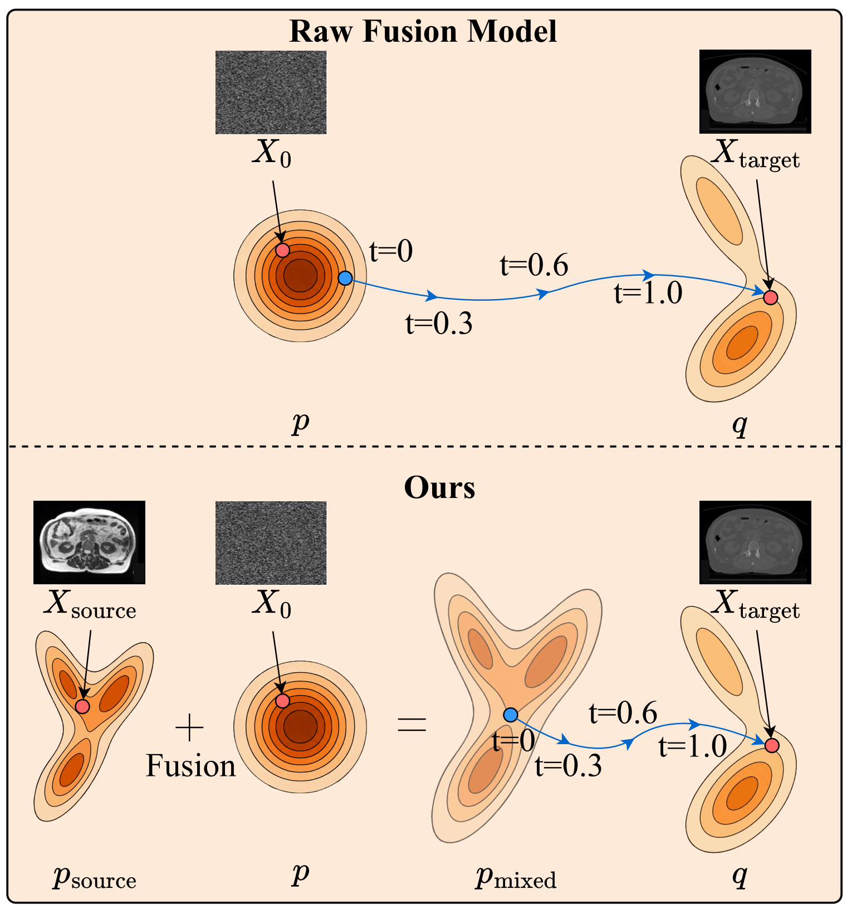
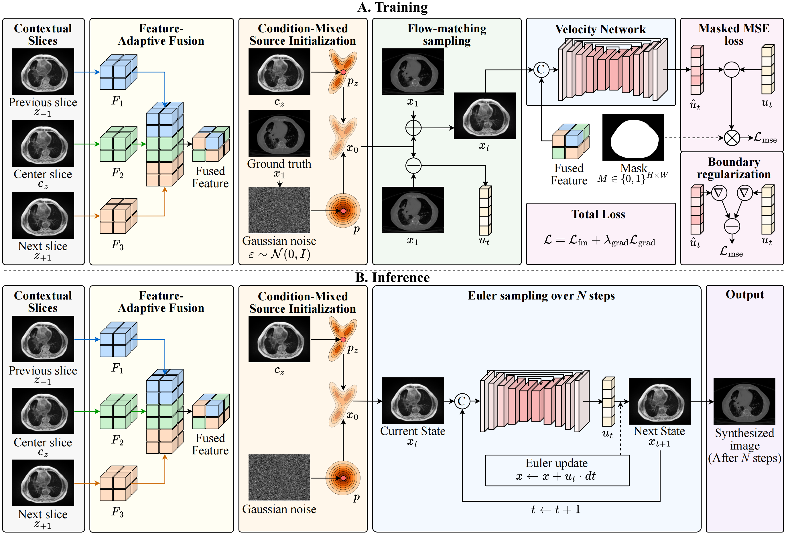
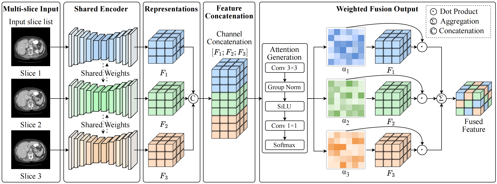

# SAFE-FM: Source-Anchored Feature-Enhanced Flow Matching for 2.5D Medical Image Translation

This repository provides a PyTorch implementation of **SAFE-FM**, a source-anchored flow-matching framework for 2.5D medical image translation.

SAFE-FM is designed for synthetic CT generation from MRI and CBCT images, including:

* MRI-to-CT synthesis
* CBCT-to-CT synthesis
* Head-and-Neck, Thorax, and Abdomen translation tasks

The method is evaluated on the multi-center SynthRAD2025 benchmark.

---

## Overview

Conventional conditional flow-matching methods typically initialize the generation trajectory from source-independent Gaussian noise and inject the source image only through conditional features. This can weaken patient-specific anatomical guidance during cross-modal image translation.

SAFE-FM addresses this limitation through three components:

1. **Condition-Mixed Source Prior**
   A source-dependent anatomical representation is mixed with Gaussian noise to construct a source-anchored initial state for flow matching.

2. **Lightweight 2.5D Feature-Adaptive Conditioning**
   The previous, center, and next source slices are encoded with shared weights and adaptively fused using spatial attention.

3. **Boundary-Aware Velocity Gradient Regularization**
   Spatial gradients of the predicted velocity field are constrained to improve the preservation of anatomical boundaries and tissue transitions.

---

## Method

### 1. Condition-Mixed Source Prior

<p align="center">
  
</p>

<p align="center">
  <a href="examples/static/1.pdf">View PDF version</a>
</p>

Instead of starting solely from Gaussian noise, SAFE-FM constructs a source-anchored initial state by combining normalized source anatomy with Gaussian noise:

$$
x_0 = \sqrt{\lambda}\phi(c_k) + \sqrt{1-\lambda}\epsilon,
\quad \epsilon \sim \mathcal{N}(0, I).
$$

Here, (c_k) denotes the source center slice, (\phi(\cdot)) denotes the normalized source-dependent anatomical representation, and (\lambda) controls the trade-off between source guidance and stochastic flexibility.

This design shifts the initial distribution toward patient-specific anatomy while retaining sufficient stochasticity for cross-modal synthesis.

---

### 2. Training and Inference Workflow

<p align="center">
  
</p>

<p align="center">
  <a href="examples/static/3.pdf">View PDF version</a>
</p>

During training, SAFE-FM uses the source slice triplet consisting of the previous, center, and next slices as contextual input. The feature-adaptive fusion module extracts a fused 2.5D condition representation. A condition-mixed source prior initializes the flow trajectory, and the velocity network is optimized using masked flow-matching loss together with boundary-aware velocity gradient regularization.

During inference, SAFE-FM starts from the same source-anchored initialization and performs Euler integration over (N) steps to generate the target-modality image.

---

### 3. Lightweight 2.5D Feature-Adaptive Conditioning

<p align="center">
  
</p>

<p align="center">
  <a href="examples/static/2.pdf">View PDF version</a>
</p>

The three neighboring source slices are processed by a shared encoder to obtain slice-wise feature representations. These features are concatenated and passed to a lightweight attention generator consisting of a 3×3 convolution, Group Normalization, SiLU activation, and a 1×1 convolution.

The generated spatial attention maps adaptively weight the feature representations from the three slices, producing a fused contextual feature for velocity-field estimation.

---

## Environment

The code was developed and tested with the following environment:

| Component    |                      Version |
| ------------ | ---------------------------: |
| Python       |                         3.12 |
| PyTorch      |                  2.8.0+cu128 |
| Torchvision  |                 0.23.0+cu128 |
| Torchaudio   |                  2.8.0+cu128 |
| CUDA Runtime |                         12.8 |
| GPU          | NVIDIA GPU with CUDA support |

---

## Installation

Create and activate a Python 3.12 environment:

```bash
conda create -n safefm python=3.12 -y
conda activate safefm

python -m pip install --upgrade pip
```

Install PyTorch with CUDA 12.8 support:

```bash
pip install \
  torch==2.8.0+cu128 \
  torchvision==0.23.0+cu128 \
  torchaudio==2.8.0+cu128 \
  --index-url https://download.pytorch.org/whl/cu128
```

Install the main runtime dependencies:

```bash
pip install \
  SimpleITK==2.5.3 \
  lpips==0.1.4 \
  POT==0.9.6.post1 \
  scikit-image==0.26.0 \
  scipy==1.17.1 \
  matplotlib==3.10.8 \
  PyYAML==6.0.3 \
  tqdm==4.67.3 \
  tensorboard==2.20.0
```

Install the local package and its remaining TorchCFM-related dependencies:

```bash
pip install -e .
```

Verify the environment:

```bash
python -c "import torch, SimpleITK, lpips, ot; print('Torch:', torch.__version__); print('CUDA available:', torch.cuda.is_available())"
```

---

## Dataset

SAFE-FM is evaluated on the **SynthRAD2025** benchmark.

* Training data: https://zenodo.org/records/15373853
* Dataset description: https://doi.org/10.5281/zenodo.14918089
* Challenge website: https://synthrad2025.grand-challenge.org/

The dataset contains two tasks:

| Task   | Source Modality | Target Modality |
| ------ | --------------- | --------------- |
| Task 1 | MRI             | CT              |
| Task 2 | CBCT            | CT              |

The dataset includes Head-and-Neck (`HN`), Thorax (`TH`), and Abdomen (`AB`) cases.

> **Important:** The dataset is not included in this repository. Please download and use it according to the official dataset license and access conditions.

---

## Dataset Preparation

After downloading and extracting the SynthRAD2025 training data, organize the dataset root as follows:

```text
SynthRAD2025/
├── synthRAD2025_Task1_Train/
│   └── Task1/
│       ├── AB/
│       ├── HN/
│       └── TH/
│
└── synthRAD2025_Task2_Train/
    └── Task2/
        ├── AB/
        ├── HN/
        └── TH/
```

Run the dataset preparation script:

```bash
python prepare_synthrad_layout.py \
  --root /path/to/SynthRAD2025 \
  --seed 3407
```

The script creates the following structure:

```text
SynthRAD2025/
├── raw/
│   ├── task1/
│   └── task2/
│
├── task1/
│   ├── AB/
│   ├── HN/
│   └── TH/
│
├── task2/
│   ├── AB/
│   ├── HN/
│   └── TH/
│
└── splits/
    └── synthrad_split_seed3407.json
```

The split is performed at the patient level using center-stratified sampling with a train/validation/test ratio of 7:1:2 and a fixed random seed of `3407`.

> **Reproducibility note:** The experimental protocol reported for SAFE-FM excludes Center D due to dataset licensing restrictions. Before preparing the data, make sure Center D cases are not included in the source folders. Otherwise, the resulting split counts will not match the reported experiments.

> **Linux note:** `prepare_synthrad_layout.py` creates symbolic links. It is therefore recommended to run this script on Linux.

To overwrite existing generated `raw/`, `task1/`, `task2/`, and `splits/` folders:

```bash
python prepare_synthrad_layout.py \
  --root /path/to/SynthRAD2025 \
  --seed 3407 \
  --force
```

---

## Training and Inference

Task-specific Linux commands for training and inference are provided in:

```text
run.txt
```

After preparing the dataset, follow the corresponding commands in `run.txt` to:

1. Train SAFE-FM models for MRI-to-CT or CBCT-to-CT synthesis.
2. Run inference on the test split.
3. Evaluate generated synthetic CT images.

```bash
cat run.txt
```

Please ensure that the dataset path, checkpoint path, task, anatomical region, and GPU configuration are correctly specified before executing a command.

---

## Repository Structure

```text
SAFE-FM/
├── examples/
│   └── static/
│       ├── 1.pdf
│       ├── 1.png
│       ├── 2.pdf
│       ├── 2.png
│       ├── 3.pdf
│       └── 3.png
│
├── prepare_synthrad_layout.py
├── run.txt
├── README.md
├── LICENSE
└── THIRD_PARTY_NOTICES.md
```
---

## Citation

If you find this repository useful in your research, please consider citing our paper:
...

---

## Acknowledgements

This project builds upon and extends components from the [TorchCFM / Conditional Flow Matching](https://github.com/atong01/conditional-flow-matching) repository.

SAFE-FM adapts the flow-matching framework for 2.5D medical image translation and introduces:

* source-anchored condition-mixed initialization;
* feature-adaptive fusion of neighboring slices;
* boundary-aware velocity gradient regularization;
* task-specific preprocessing, training, and inference pipelines for synthetic CT generation.

The original TorchCFM license notice is retained in this repository. Please refer to `LICENSE` and `THIRD_PARTY_NOTICES.md` for third-party license information.

---

## License

This repository includes code derived from TorchCFM, which is distributed under the MIT License.

The SynthRAD2025 dataset is not redistributed by this repository and remains subject to its official license and access conditions.
